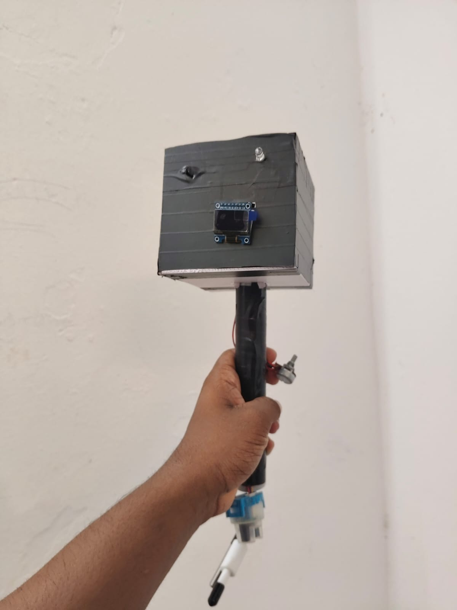
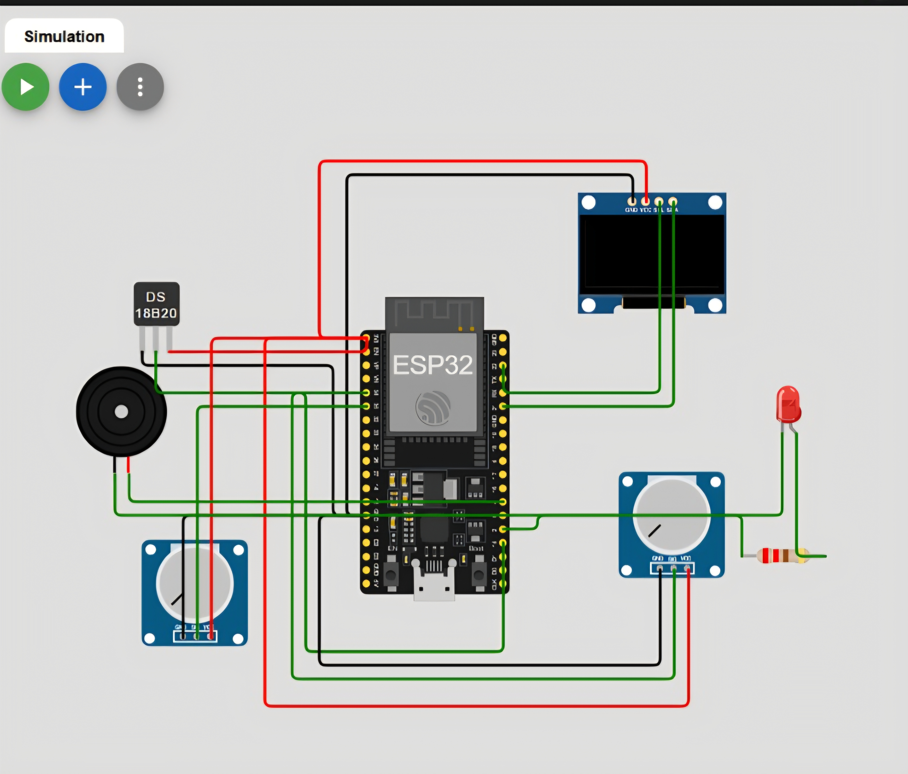

# IoT Water Quality Monitoring System (ESP32 + Blynk)

## Overview
This project implements a real-time water quality monitoring system using ESP32 and multiple sensors. It continuously measures temperature, turbidity, and TDS levels and provides automated alerts. The system integrates with the Blynk platform for remote monitoring and visualization.

## Problem Statement
Maintaining optimal water quality in aquaculture and environmental systems is critical. Manual monitoring is inefficient and can lead to delayed responses, affecting system safety and performance.

## Objective
To design a low-cost embedded IoT system capable of continuous water quality monitoring with real-time alerts and remote data access.

## Components Used
- ESP32 (WiFi-enabled microcontroller)
- Temperature Sensor (DS18B20)
- Turbidity Sensor
- TDS Sensor
- OLED Display (SSD1306)
- Buzzer
- LED

## Features
- Continuous real-time monitoring  
- WiFi-based remote monitoring using Blynk  
- OLED display for local visualization  
- Threshold-based alert system (LED + buzzer)  
- Integrated embedded + IoT system  

## System Architecture
Sensors → ESP32 → Data Processing →  
→ OLED Display (local monitoring)  
→ Blynk App (remote monitoring)  
→ Alert System (LED + Buzzer)

## IoT Integration
The ESP32 sends real-time sensor data to the Blynk cloud platform via WiFi. Users can monitor system parameters remotely through the Blynk mobile application.

## Working Principle
- Sensors continuously collect water parameters (temperature, turbidity, TDS)  
- ESP32 processes sensor data  
- Data is displayed on OLED display  
- Data is transmitted to Blynk platform  
- Alerts are triggered when parameters exceed thresholds  

## Practical Implementation
The system is designed as a fixed monitoring unit for continuous deployment. It can be installed in aquaculture tanks, ponds, or water systems to provide uninterrupted monitoring without manual intervention.

## Deployment Scenario
- Aquaculture tanks  
- Fish farming ponds  
- Water treatment systems  
- Environmental monitoring setups  

## Simulation Note
In simulation, potentiometers were used to emulate analog sensor inputs (turbidity and TDS) due to the unavailability of specific sensors in the simulation environment.

This allowed testing of signal processing and alert logic before implementing the physical system.

## Development Approach
- Simulation using potentiometers to emulate sensor signals  
- Hardware implementation using real sensors  
- Integration with ESP32 for processing and IoT communication  

## Results
- Successfully implemented real-time monitoring system  
- Stable sensor integration achieved  
- IoT-based remote monitoring demonstrated  
- Alert system functioning correctly  

## Note
Currently, pH value is used as a placeholder in the code and can be replaced with an actual pH sensor in future improvements.

## Project Structure

## Project Images

### Prototype Setup

## Circuit Diagram

## Future Improvements
- Integration of pH sensor  
- Cloud data logging and analytics  
- Mobile app enhancements  
- PCB-based compact design  
- Improved enclosure design  

## Author
Akshaj C P  
B.Tech ECE Student  
